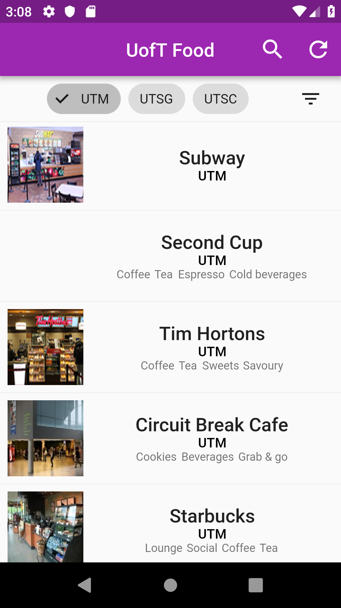
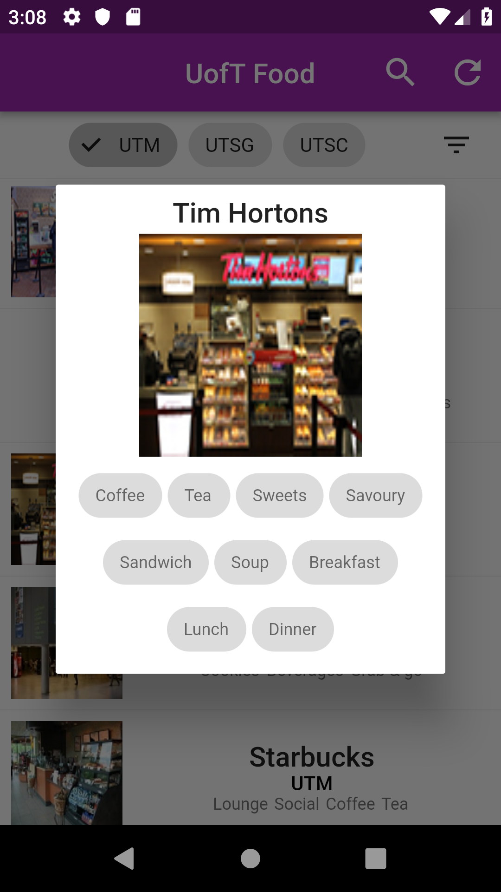

# UofT Foods

## Description
A Flutter Mobile App designed to aid UofT Students and Staff easily find food options across all campuses.

## Features
- Campus Selection Filters
- Store Tags
- Store hours
- Open notifier
- Search

### Coming soon
- Sorting
- "Nearby"
- "Navigate"
- Ratings
- Favorites 

## App Development Progression
### V1.0
Screenshots coming!

### V0.9 

### V0.3

## Disclaimer because I am just a student and do not want to be sued.
We are not affiliated, associated, authorized, endorsed by, or in any way officially connected with University of Toronto, or any of its subsidiaries or its affiliates. The official Stanford website can be found at https://www.utoronto.ca/ . The name “University of Toronto” as well as related names, marks, emblems and images are registered trademarks of University of Toronto. 
